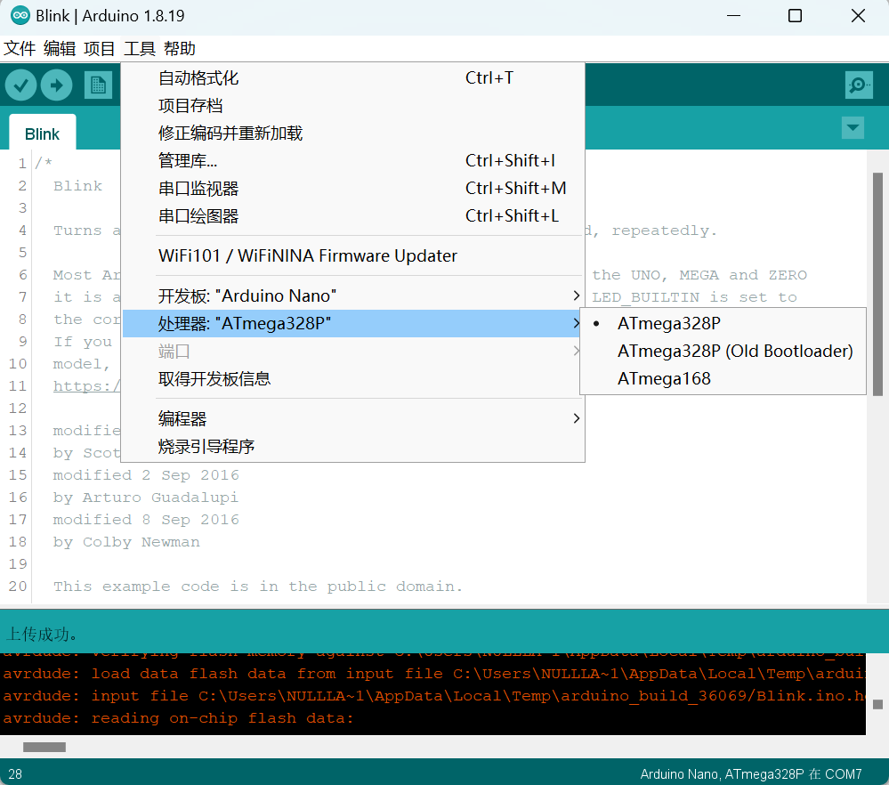

# ble-nano介绍

## 什么是ble-nano

​	ble-nano是基于低功耗蓝牙芯片结合经典的Arduino Nano V3.0主板，由emakefun针对创客而研发的一款创造性产品，功能和引脚，使用方法，完全兼容传统Arduino NanoV3.0主板，工作频段为2.4GHZ 范围，调制方式为 GFSK，  接收灵敏度-96dBm ,最大发射功率为 +5db，最大发射距离超过200米，采用RISC-V架构CH573芯片设计，支持用户通过AT命令修改查看设备名、服务UUID、发射功率、配对密码等指令，方便快捷使用灵活。产品身材非常小，适合于很多对于体积有苛刻限制的应用。

​	提供Android和IOS手机demo，你可以借助Arduino应用生态，快速开发出一款与手机通信的硬件设备。正如现在非常火爆的可穿戴式手机周边设备，都可以用Ble-Nano这款平台开发，你可以使用ble-nano与BLE蓝牙设备连接，也可以两个ble-nano主从通信。同时我们为开发者提供了极大的自由度和支持准备，用户不仅可以通过AT指令调试ble-nano，你还可以在ble-nano控制器上添加Arduino兼容的扩展板、传感器、电机和舵机驱动等，emakefun独家研发蓝牙主机模式自动连接从机功能，并支持超过20个字节发送，使用更加方便。

 软件方面支持ble-at软件框架
## 系统架构图

 kicad画一张工作时序图

## 产品参数 对比

arduino nano , ble-nano3.0,  ble-nano4.2  ble-nano5.3 四款产品对比表格

| 名字     | nano                           | ble-nano3.0                                      | ble-nano4.2                                      | ble-nano5.3                     |
| -------- | ------------------------------ | ------------------------------------------------ | ------------------------------------------------ | ------------------------------- |
| 图片     |         |                        |                                                  |                                 |
| 主控芯片 | ATmega328P-AU(QFP32)           | ATmega328P-MU(QFN32)                             | ATmega328P-MU(QFN32)                             | ATmega328P-MU(QFN32)            |
| BLE      | 无                             | TI CC2540蓝牙4.2 0dBm发射 距离50米 功耗24mA | WCH CH571F BLE4.2 0dBm距离150m  发射功耗6mA | WCH CH571F BLE5.3 距离300m |
| 驱动     | CH340G下载芯片                 | CC2540驱动                                       | 兼容Arduio Uno驱动                               | 兼容Arduio Uno驱动              |
| 参数     | PCB尺寸：45x18mm 双面焊接 | PCB尺寸：48x19mm 双面焊接                   | PCB尺寸：48x18mm 单面贴片                   | PCB尺寸：48x18mm 单面贴片  |
| 接口     | Mini-Usb接口                   | Micro-Usb接口                                    | Type C                                           | Type C                          |

### 核心参数

* 与 Arduino Nano V3.0引脚和使用方法完全兼容  
* BLE芯片: RISC-V架构ch57xF芯片，一款高度兼容（TI CC2540蓝牙SOC）
* 工作频道 2.4G
* 传输距离：空旷情况下，在0dB发送功率通讯距离约170m，在 3dBm 发送功率时约 240m 
* 支持AT指令配置BLE
* 支持USB虚拟串口，硬件串口,BLE三向透传 
* 支持主从机切换
* 主机模式下支持蓝牙自动连接从机
* 支持超过20byte发送,   自动分包  。
* 接口:TypeC
* 输入电压：usb供电,Vin6~12V ，5V  
* 微处理器： ATmega328P-MU QFN32  
* 引脚：两排2.54mm-15Pin
* 尺寸：48mm x 18mm x 12mm  
* 重量：18g

### 引脚说明

###  原理图

###  机械尺寸标注图

###  指示灯说明

* B:  蓝牙连接状态指示灯-当蓝牙未链接时，1s间隔闪烁，当蓝牙连接上后常亮；蓝牙接收或者发送数据时，会快闪
* RX TX: 串口收据收发指示灯
* L 为 arduino引脚13引脚 为blink灯

# ble-nano驱动安装

ble-nano的usb采用的是兼容Arduino的官方串口驱动，所以安装驱动的方法和官方Arduino Uno驱动是一致的.

## ble-nano通过Arduion IDE上传程序

ble-nano烧写的为最新Arduino Nano官方Bootloader所以需要使用IDE 1.8.8版本以上来烧写程序
请前往 [Arduino官网](https://www.arduino.cc/en/Main/Software) 载最新IDE

选择开发板类型为Arduino Nano 处理器为 ATmega328P

# ble-nano和电子设备连接

## Ble-Nano和安卓手机连接

1)	打开Arduino IDE，连接串口

2)	测试AT指令，设置BLE-Nano的USB和蓝牙数据传输模式设置为USB串口数据和BLE透传

注意如果是其他串口助手一定要发送回车换行作为结束符。

3)	安卓或则IOS从设置中是无法连接使用的，因为手机设置都是只能连接经典蓝牙兼容蓝牙耳机，蓝牙麦克风等外设，不能连接低功耗蓝牙。安卓手机（android4.2以上）安装BLE_TOOL.apk (注意需要打开蓝牙，和定位权限)如下图操作

（IOS手机应用商城搜索安装LightBlue），打开测试APP,界面。找到对应的蓝牙名（Ble-Nano）并点击进行连接,连接，此时会出现4个选项，分别用于测试不同的功能，因为这里我们只测试蓝牙是否可以正常收发数据，所以我们选择SK Service入，再选择SK_KEYPRESSED

4)	我们选择“SK-KEYPRESSED”,点击后如图3.1.9我们可以看到有一个“写入”按键，点击即可进入，我们点击“红色框”即可输入想发送的数据，输入完成后点击“发送”即可将数据发出去

5)	点击发送后，我们可以看到串口监视器上打印出了手机端发送的内容，如图3.1.11示，说明蓝牙模块是可以正常发送数据的，当然，为了测试准确度更高，可以多测试几次，并尝试在不同的环境中测试。

6） 我们可以在串口监视器上输入想发送的内容，完成后点击“Send”，便可将数据通过蓝牙发送到手机APP上

在上面的测试过程中，PC端和安卓端都可正常收发数据，说明Ble-Nano通讯正常，达到预期的效果.

## Ble-Nano和苹果手机连接

1)	在APP store 中搜索LightBlue,下载软件LightBlue○RExplorer。

2)	安装APP后，打开APP扫描到BLE-NANO

3)	连接BLE-NANO蓝牙

4)	选择字符类型，并点击Write  new value，输入字符即可给BLE-NANO 发送数据。

## Ble-Nano和Win10蓝牙连接

同样道理win10的设置里面是无法和我们BLE-Nano连接的，它只能连接经典蓝牙，但是我们可以微软官方应用商城下载 BluetoothLEExplorer

先把板子usb和蓝牙开关打开

点击开始扫描

找到我们名字为Ble-Nano的设备，点击连接

我们选择字符特征码Characteristic1

Win10发送helloword给到Ble-Nano如下

Ble-Nano发送hellowin10

如果我们想通过win10自带蓝牙和ble-nano那么你需要基于Microsoft官方BLE SDK二次开发，请查看开发者说明
<https://docs.microsoft.com/zh-cn/windows/uwp/devices-sensors/gatt-server>
以及视频 <https://channel9.msdn.com/Events/Build/2017/P4177>
很幸运win10提供了专业的源代码请参考
<https://github.com/Microsoft/Windows-universal-samples/tree/master/Samples/BluetoothLE>
<https://github.com/Microsoft/BluetoothLEExplorer>
当然这是一个非常麻烦的事情，假如不是必要的话，强烈建议使用2块Ble-Nano设备来完成你的想法，详细参考后面章节《Ble-Nano结合Processing实际应用》

# AT指令介绍

## AT指令集

ble-nano的AT指令可通过Arduino Uno自带的硬件串口0（RX)、1 (TX）控制，波特率支持9600,19200,38400,57600,115200。ble-nano串口默认波特率为115200bps。

AT指令还可以通过直连TypeC数据线直连控制和APP的为0xFFE2的characteristics来控制。

（注：发AT指令时必须回车换行， AT指令只能在模块未连接状态下才能生效，一旦蓝牙模块与设备连接上，蓝牙模块即进入数据透传模式。AT指令区分大小写，均以回车换行字符结尾：\r\n））

|序列  | 指令 | 描述 | 主(Master)/从(Slave) |默认 |
|---- | ----| ----| ---- |---- |
|1 | AT | 测试 | M/S | |
|2 | AT+ALL	| 打印ble-nano所有的配置信息 | M/S |	|
|3 | AT+RESET	| 软件复位ble-nano | M/S |	|
|6 | AT+VER	| 查看ble-nano固件版本号 | M/S |  |
|2 | AT+BAUD | 配置串口波特率	 | M/S	| 115200 |
|5 |AT+NAME |	查看配置蓝牙广播名字	|	ble-nano ||
|7 |	AT+MAC	| 查看设置蓝牙12位mac地址	| M/S |  |
|14 |	AT+AUTH	| 设置蓝牙连接是否需要鉴权	| S | 0 |
|15 |	AT+PASS	| 设置蓝牙连接密码	| S | 123456 |
|8 |	AT+ROLE |	配置主从模式 |	M/S	 | 1 |
|9 |	AT+SCAN |	扫描周边的蓝牙设备 |	M |  |
|10 |	AT+CONN	 |连接扫描结果对应下标的蓝牙设备	 |M |  |
|11 |	AT+CON |	连接对应mac地址的蓝牙设备 |	M |  |
|12 |	AT+CONNAME |	连接对应广播名字的蓝牙设备 |	M | |
|1 |	AT+AUTOCON |	自动连接上次成功连接的从机设备，重启生效 |	M | 0 |
|13 |	AT+DISCON |	断开当前的链接 | M |  |
|16 |	AT+MODE |	设置蓝牙工作模式 |	M/S |	0 |
|17 |	AT+BLEUSB | 设置蓝牙的USB和蓝牙数据传输模式 |	M/S | 0 |
|18 |	AT+TXPOWER	 | 设置蓝牙发射功率 | M/S |	0 |
|19	| AT+MINI_INTERVAL |	设置ble-nano最小通信间隔 |	M/S	 | 6 |
|20	| AT+MAX_INTERVAL |	设置ble-nano最大通信间隔 |	M/S	 | 6  |
|21 |	AT+SRVUUID |	设置获取蓝牙特征码SRVUUID |	M/S	 | 0xFFE0 |
|22 |	AT+CHARUUID |	设置获取字符特征码CHARUUID |	M/S |	0xFFE1 |
|23 |	AT+RXGAIN |	设置ble-nano接收增益 |	M/S	 | 1 |
|25 |	AT+SETTING |	恢复出厂系统设置 |	M/S |  |
| 26 |	AT+SLEEP |	设置睡眠模式 |	M/S | |

## AT指令集详细说明

1、	测试指令

| 指令 | 响应 | 参数 |
|---- | ----| ----|
|AT  |	OK | 无 |

2、	打印Ble-Uno所有配置信息指令

| 指令 | 响应 | 参数 |
|---- | ----| ----|
|AT+ALL  | 详细配置信息 OK | 无 |

3、	配置串口波特率

| 指令 | 响应 | 参数 |
|---- | ----| ----|
|AT+BAUD=< Param>  | +BAUD=<  baud > OK | 0:9600  1:19200  2:38400  3:57600  4:115200 |

6、	配置蓝牙名字

| 指令 | 响应 | 参数 |
|---- | ----| ----|
|AT+NAME=< Param > |	OK+Name=< Param >+SUCCESS	 | 蓝牙名字 |

7、	查询Ble-Uno固件版本

| 指令 | 响应 | 参数 |
|---- | ----| ----|
| AT+VER | 	OK+Version=<  Result  > | 无 |

8、	查询蓝牙的Mac地址

| 指令 | 响应 | 参数 |
|---- | ----| ----|
|AT+MAC |	OK+Mac=< Result >	 | 无 |

9、	查询设置蓝牙主从模式

| 指令 | 响应 | 参数 |
|---- | ----| ----|
|AT+ROLE=< Param > |	OK+RoleMode=< Param >+SUCCESS | 0:主机   1:从机 |

10、	蓝牙主从模式下扫描附近从机

| 指令 | 响应 | 参数 |
|---- | ----| ----|
| AT+SCAN |	OK+Scan   OK+DISC[0]:xxxx   OK+DISC[1]:xxxx   ……   OK+SCAN DONE |	无 |

11、	通过扫描返回下标连接从机蓝牙

| 指令 | 响应 | 参数 |
|---- | ----| ----|
| AT+CONN=<  Param  > |	OK+CONN=< Param > |	扫描从机蓝牙下标数字 |

12、	通过连接主从蓝牙Mac地址连接从机蓝牙

| 指令 | 响应 | 参数 |
|---- | ----| ----|
| AT+CON=< Param > |	OK+CON=< Param > |	从机蓝牙地址 |

OK+Scan
OK+DISC[0]:3234CFE9D1C3
OK+DISC[1]:464288AEAB8F
OK+DISC[2]:3CA5080A62FB
OK+DISC[3]:30AEA42BF189
OK+DISC[4]:58803C6EFB0A
OK+SCAN DONE
AT+CONN=1代表连接扫描得到的第二个蓝牙设备
AT+CON=464288AEAB8F 直接连接Mac地址为464288AEAB8F的设备

13、	开启蓝牙自动连接模式    开启后，蓝牙模块将自动连接上次成功连接过的设备

| 指令 | 响应 | 参数 |
|---- | ----| ----|
| AT+BOND=<  Param  > | OK+AutoCon=<  Param  >+SUCCESS  |  0:关闭自动连接   1:开机自动连接  |

14、	断开当前连接蓝牙设备

| 指令 | 响应 | 参数 |
|---- | ----| ----|
| AT+DISCON |	OK+Disconnect |	无 |

15、	设置蓝牙的连接是否需要密码

| 指令 | 响应 | 参数 |
|---- | ----| ----|
| AT+AUTH=<  Param  >  | OK+AuthMode=< Param >+SUCCESS | 0:连接无密码  1:需要密码连接 |

16、	设置蓝牙的连接是密码

| 指令 | 响应 | 参数 |
|---- | ----| ----|
|AT+ PASS=< Param > |	OK+ PassWord=< Param >+SUCCESS |  |

17、	设置蓝牙的工作模式

| 指令 | 响应 | 参数 |
|---- | ----| ----|
|AT+ MODE=< Param > |	OK+ WorkMode=< Param >+SUCCESS | 0:透传 1:驱动模式 2:iBeacon |

18、	设置蓝牙的USB和蓝牙数据传输模式

| 指令 | 响应 | 参数 |
|---- | ----| ----|
|AT+ BLEUSB=< Param > | +BLEUSB=< Param > PK |	0:关闭 1:USB串口数据传给BLE 2:BLE数据传给USB串口 3:USB串口数据和BLE透传 |

19、	设置蓝牙的发射功率

| 指令 | 响应 | 参数 |
|---- | ----| ----|
|AT+MINI_INTERVAL=< Param > |	OK+ Mini_Interval=< Param > +SUCCESS |	PC和Android，建议设为为10   iOS设备，建议设置为20 |

20 设置BLE芯片最大通信间隔，以毫秒为单位

| 指令 | 响应 | 参数 |
|---- | ----| ----|
|AT+MINI_INTERVAL=< Param > |	OK+ Mini_Interval=< Param >+SUCCESS |	PC和Android，建议设为为10  iOS设备，建议设置为20 |

21、设置BLE芯片最大通信间隔，以毫秒为单位

| 指令 | 响应 | 参数 |
|---- | ----| ----|
|AT+MAX_INTERVAL=< Param >	 | OK+Max_Interval=< Param >+SUCCESS |	PC和Android，建议设为为10   iOS设备，建议设置为40 |

22、设置BLE接收增益

| 指令 | 响应 | 参数 |
|---- | ----| ----|
|AT+RXGAIN=< Param > |	OK+RxGain =< Param >+SUCCESS |	0：标准增益  1：高增益 |

23、设置BLE特征码UUID

| 指令 | 响应 | 参数 |
|---- | ----| ----|
|AT+SRVUUID	 |Servic UUID=0XFFE0 |  |

24、设置BLE字符特征码
| 指令 | 响应 | 参数 |
|---- | ----| ----|
|AT+CHARUUID |	Char UUID=0XFFE1 |  |

25、软件复位

| 指令 | 响应 | 参数 |
|---- | ----| ----|
|AT+RESETR | 无 |无 |

26、系统设置

| 指令 | 响应 | 参数 |
|---- | ----| ----|
|AT+SETTING=< Param >  | +SUCCESS | DEFAULT恢复出厂设置   PARI_DEFAULT清除配对信息 |

## 开发说明

因为产品的蓝牙是透传功能，所以蓝牙编程，其实就是对arduino的串口(Serial)进行读写操作我们编程时需要注意两点
1、BLE协议规定每个蓝牙数据包长度不能超过20byte，我们蓝牙模块做了分包发送，但是有低概率丢包，所以超过20个字节的时候，arudino分包发送最为可靠。
2、每一包数据发送间隔需要超过150ms，否则容易丢包。

## Ble-Nano主从通讯以及结合Processing实际应用

很多时候我们是使用Ble-Nano和Processing来完成自己构想，那么最简单的方案如下图

Step1. usb连接从机(COM22)先读取到从机（COM21）的mac地址如下

Step2. Usb连接到主机Ble-Nano设置成主机（COM22）模式

Step3.把（COM21）自动连接功能打开方便下次上电可以直接连接

Step4. AT+BLEUSB=3 主机（COM22)把USB串口和蓝牙通讯功能打开这样蓝牙就可以和usb端口直接通讯

Step5. AT+CON加从机（COM21)mac地址即可直接连接

注意如果主机里面有其他程序会影响使用，建议主机arduino烧录一个空白程序进去主机接电脑会虚拟一个端口出来，在我的电脑 设备管理器可以查看到端口号，processing程序选择对应的端口号即可完成通讯

## 常见问题

**1)	问Ble-Nano和普通Nano板有何区别，我要如何开始使用这个开发板**

答： Ble-Uno是在原来官方arduino uno r3基础上添加CC2540蓝牙4.0功能
接口Mini-Usb升级成更加通用Micro-Usb接口，引脚功能完全兼容
Bootload烧写最新bootload需要使用1.8.8以上IDE才可以烧写，其他使用方法请参考官方arduino nano使用方法。

**2)	问：蓝牙如何手机电脑连接**
答： Ble-Nano为Ble设备，不能直接和手机设置里面蓝牙连接，需要通过BLETestTools.apk (IOS LightBlue)连接，如要开发参考源代码二次开发，windows的设置也是经典蓝牙连接方式，需要微软官网参考BLE SDK开发。

**3)	问：常见的蓝牙4.0之间通信不正常的问题。**

答：建议检查步骤：
1 更新固件至最新版本；
2 通过AT指令恢复出厂设置 (AT+SETTING=DEFAULT). （详见:通过AT指令配置BLE设备 ）
3 检查蓝牙模块、程序代码等相关地方的通信波特率是否一致；（晶振频率为8MHz的控制板支持最大38400bps的波特率。）
4.配对蓝牙设备是否支持4.0，还有CC2540和其他品牌蓝牙模组会存在兼容性问题，使用尽可能和CC25xx系类蓝牙模块连接

**4） 问：为什么我的手机连不上Ble-Nano，即使可以连上，但也不能通信？**

答：请检查您的手机是否支持蓝牙4.0。另外，请使用APP内的Scan按钮扫描连接Ble-Nano，连接不需要密码。不支持手机蓝牙设置界面、其他BLE APP连接。

**5）问：如何使用Ibeacon功能？**

答：不支持

**6）问：Ble-Nano支持多联吗？我想用一个主机连接很多从机，请问最多能连几个？**

答：Ble-Nano不支持多联，但是可以通过不断地切换绑定从机，实现多联的思想。

**7) 问：为什么Ble-Nano系列的蓝牙4.0产品无法连接蓝牙2.0的设备？**

答：由于我们的Ble-Nano系列为了实现极低的功耗，采用了单模蓝牙低功耗（Bluetooth Smart），硬件和软件上都做了优化，只能支持BLE，不支持连接蓝牙2.0设备。