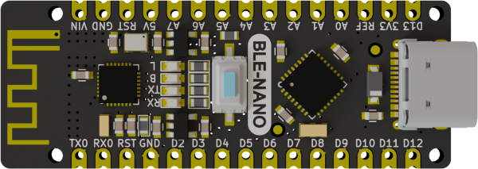
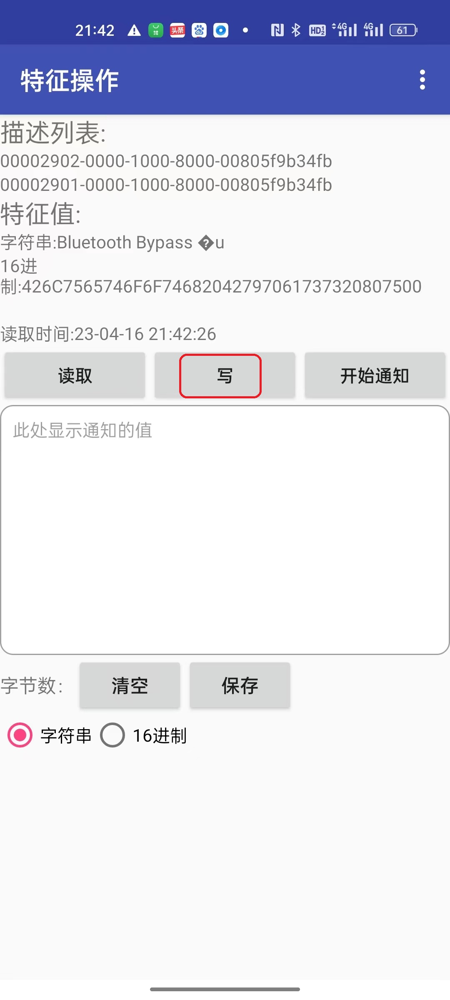
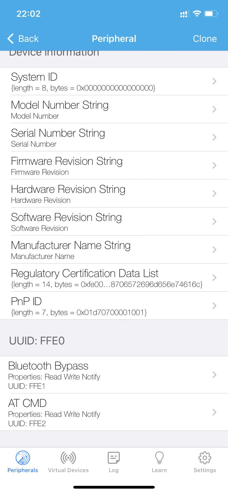

 [English](./README.md)

# ble-nano介绍


## 什么是ble-nano

​	ble-nano是emakefun公司基于官方标准Arduino Nano V3.0主板上集成低功耗蓝牙芯片而开发一款具备无线蓝牙功能的开发板，它的功能和引脚，使用方法，完全兼容标准的Arduino Nano V3.0主板，工作频段为2.4GHZ 范围，调制方式为 GFSK， 接收灵敏度-96dBm，最大发射功率为+5db，最大发射距离超过200米，采用RISC-V架构CH573芯片设计，支持用户通过AT命令查看修改设备名、服务UUID、发射功率、配对密码等指令，方便快捷使用。产品身材非常小，适合于很多对于体积有苛刻限制的应用。

​	提供Android和IOS手机demo，你可以借助Arduino应用生态，快速开发出一款与手机通信的硬件设备。正如现在非常火爆的可穿戴式手机周边设备，都可以用ble-nano这款平台开发，你可以使用ble-nano与BLE蓝牙设备连接，也可以两个ble-nano主从通信。同时我们为开发者提供了极大的自由度和支持准备，用户不仅可以通过AT指令调试ble-nano，你还可以在ble-nano控制器上添加Arduino兼容的扩展板、传感器、电机和舵机驱动等，

## 系统架构图

 


## 核心参数

#### 低功耗蓝牙BLE参数

* BLE芯片: RISC-V架构ch57xF芯片（高度兼容TI CC2540蓝牙SOC）
* 工作频道: 2.4G
* 0dBm 发送功率时电流 6mA  
* 接收灵敏度  -96dBm，可编程+5dBm 发送功率  。
* 传输距离：空旷情况下，在0dB发送功率通讯距离约170m，在 3dBm 发送功率时约 240m 
* 支持usb串口，arduino串口，蓝牙三种方式，AT指令配置，支持主从模式切换
* 支持USB虚拟串口，硬件串口，BLE三向透传 
* 主机模式下支持蓝牙自动连接从机
#### 主控核心参数
* 处理器: ATmega328P-MU QFN32
* 数字IO引脚：22个(其中6个用作PWM输出)
* 模拟输入引脚：8 (A0~A7) 
* IO引脚直流电流：40mA 
* 5V 引脚电流：VIN输入时500mA
* 3.3V引脚电流 :  500mA
* Flash内存：32KB(其中0.5KB用于引导加载程序) 
* SRAM： 2KB
* EEPROM： 1KB
* USB转串口芯片： CH57xF芯片，兼容arduino官方uno驱动
* 工作时钟：16 MHZ

## 参数对比

arduino nano , ble-nano3.0,  ble-nano4.2  ble-nano5.3 四款产品对比表格

| 名字     | nano                           | ble-nano3.0                                      | ble-nano4.2                                                  | ble-nano5.3                                            |
| -------- | ------------------------------ | ------------------------------------------------ | ------------------------------------------------------------ | ------------------------------------------------------ |
| 图片     |          |                        |  |  |
| 主控芯片 | ATmega328P-AU(QFP32)           | ATmega328P-MU(QFN32)                             | ATmega328P-MU(QFN32)                                         | ATmega328P-MU(QFN32)                                   |
| BLE      | 无                             | TI CC2540蓝牙4.0<br />0dBm发射 距离30米 功耗24mA | WCH CH571F BLE4.2<br />0dBm距离150m  发射功耗6mA             | BLE5.3<br />距离300m                                   |
| 驱动     | CH340G串口芯片                 | CC2540驱动                                       | 兼容Arduio Uno驱动                                           | 兼容Arduio Uno驱动                                     |
| 参数     | PCB尺寸：45x18mm<br />双面贴片 | PCB尺寸：49x19mm<br />双面贴片                   | PCB尺寸：48x18mm<br />单面贴片                               | PCB尺寸：48x18mm<br />单面贴片<br />邮票孔             |
| 接口     | Mini-Usb接口                   | Micro-Usb接口                                    | Type C                                                       | Type C                                                 |

### 引脚说明


###  原理图

[原理图下载](schematic/ble-nano_v4.2.pdf)


###  尺寸标注图


###  


###  指示灯说明

* B:  蓝牙连接状态指示灯-当蓝牙未链接时，1s间隔闪烁，当蓝牙连接上后常亮；蓝牙接收或者发送数据时，会快闪
* RX TX: 串口收据收发指示灯
* L 为 arduino的13引脚blink灯

# ble-nano驱动安装

ble-nano的usb采用的是兼容Arduino的官方串口驱动，所以安装驱动的方法和官方Arduino Uno驱动是一致的.

## ble-nano通过Arduion IDE上传程序

ble-nano烧写的为最新Arduino Nano官方Bootloader所以需要使用IDE 1.8.8版本以上来烧写程序
请前往 [Arduino官网](https://www.arduino.cc/en/Main/Software) 载最新IDE

选择开发板类型为Arduino Nano 处理器为 ATmega328P，如下图


# ble-nano和电子设备连接

## ble-nano和安卓手机连接

1)	打开ble控制程序[ble_control_led.ino](./example/ble_contorl_led/ble_contorl_led.ino)主板上Link（引脚13）上的LED灯程序

```c
String ble_data;
int led_pin = 13;

void setup() {
  Serial.begin(115200);
  ble_data = "";
  pinMode(led_pin, OUTPUT);
}

void loop() {
  while (Serial.available() > 0)  
  {
      ble_data += char(Serial.read());
      delay(2);
  }
  if (ble_data.compareTo("on") == 0) {
    Serial.println("turn on led");
    digitalWrite(led_pin, HIGH);
  }
  if (ble_data.compareTo("off") == 0) {
    Serial.println("turn off led");
    digitalWrite(led_pin, LOW);
  }   
  ble_data = "";
}
```

2)	安卓或则IOS从设置中是无法连接使用的，因为手机设置都是只能连接经典蓝牙兼容蓝牙耳机，蓝牙麦克风等外设，不能连接低功耗蓝牙。安卓手机（android4.2系统版本以上）安装[BleToolsTest](https://github.com/nulllaborg/BleTools/raw/master/NulllabBlutooth/app/release/BleToolsTest.apk) 可以参考开源[Android源代码](https://github.com/nulllaborg/BleTools)  (注意需要打开蓝牙，和定位权限)如下图操作）

| 打开手机定位                                                 | 允许BLE测试工具定位权限                                      |
| ------------------------------------------------------------ | ------------------------------------------------------------ |
|  |  |

3）打开测试APP,界面。找到对应的蓝牙名（ble-nano4.2/ble-nano5.3）并点击进行连接，此时会出现4个选项，分别用于测试不同的功能，因为这里我们只测试蓝牙是否可以正常收发数据，所以我们选择SK Service入，再选择SK_KEYPRESSED


| 连接蓝牙名字                                                 | 选择service                                                  | 选择char service                                             |
| ------------------------------------------------------------ | ------------------------------------------------------------ | ------------------------------------------------------------ |
|  |  |  |

4)	我们选择“SK-KEYPRESSED”,点击后如图3.1.9我们可以看到有一个“写入”按键，点击即可进入，我们点击“红色框”即可输入想发送的数据，输入完成后点击“发送”即可将数据发出去


|                                                              |                                                              |
| ------------------------------------------------------------ | ------------------------------------------------------------ |
|  |  |

5)	点击发送字符串"on"后，打开ArduinoIDE的串口监视器上打印 turn on led，同时观察ble-nano上的L灯点亮，代表app蓝牙控制主板上的L灯成功，同样的方法发送字符串“off”后，ble-nano上的L灯会熄灭。到此我们安卓手机蓝牙测试完成。


## ble-nano和苹果手机/电脑/平板连接

1)	在APP store 中搜索LightBlue,下载软件LightBlue RExplorer，并打开。

|                                                              |                                                              |
| ------------------------------------------------------------ | ------------------------------------------------------------ |
|  |  |

2)	安装APP后，打开APP扫描到ble-nano,并连接

|                                                              |                                                              |
| ------------------------------------------------------------ | ------------------------------------------------------------ |
|  |  |

4)	选择字符类型，并点击Write  new value，输入字符即可给ble-nano发送数据。

|                                                              |                                                              |                                                              |
| ------------------------------------------------------------ | ------------------------------------------------------------ | ------------------------------------------------------------ |
|  |  |  |

5) 点击done后会发送字符串"on"后，打开ArduinoIDE的串口监视器上打印 turn on led，同时观察ble-nano上的L灯点亮，代表app蓝牙控制主板上的L灯成功，同样的方法发送字符串“off”后，ble-nano上的L灯会熄灭。到此我们IOS蓝牙测试完成。


## ble-nano和win10蓝牙连接

笔记本电脑win10的设置里面蓝牙也无法在设置里面直接和ble-nano连接的，它只能连接经典蓝牙，去微软官方应用商城下载Bluetooth LE Explorer

如果我们想通过win10自带蓝牙和ble-nano那么你需要基于Microsoft官方BLE SDK二次开发，请查看开发者说明
<https://docs.microsoft.com/zh-cn/windows/uwp/devices-sensors/gatt-server>
以及视频 <https://channel9.msdn.com/Events/Build/2017/P4177>
很幸运win10提供了专业的源代码请参考
<https://github.com/Microsoft/Windows-universal-samples/tree/master/Samples/BluetoothLE>
<https://github.com/Microsoft/BluetoothLEExplorer>
当然这是一个非常麻烦的事情，假如不是必要的话，强烈建议使用2块ble-nano设备来完成你的想法，详细参考后面章节。

# AT指令介绍

## AT指令集

ble-nano的AT指令可通过Arduino自带的硬件串口0（RX)、1 (TX）控制，波特率支持9600、19200、38400、57600、115200。ble-nano串口默认波特率为115200bps。

AT指令还可以通过直连TypeC数据线直连控制和APP的为0xFFE2的characteristics来控制。

（注：发AT指令时必须回车换行， AT指令只能在模块未连接状态下才能生效，一旦蓝牙模块与设备连接上，蓝牙模块即进入数据透传模式。AT指令区分大小写，均以回车换行字符结尾：\r\n））

|序列  | 指令 | 描述 | 主(Master)/从(Slave) |默认 |
|---- | ----| ----| ---- |---- |
|1 | AT | 测试 | M/S | |
|2 | AT+ALL	| 打印ble-nano所有的配置信息 | M/S |	|
|3 | AT+RESET	| 软件复位BLE蓝牙芯片 | M/S |	|
|4 | AT+TARGE_RESET	| 复位Arduino(Atmega328P芯片) | M/S |	|
|5 | AT+VER	| 查看ble-nano固件版本号 | M/S |  |
|6 | AT+BAUD | 配置串口波特率	 | M/S	| 115200 |
|7 |AT+NAME |	查看配置蓝牙广播名字	|	ble-nano ||
|8 |	AT+MAC	| 查看设置蓝牙12位mac地址	| M/S |  |
|9 |	AT+AUTH	| 设置蓝牙连接是否需要鉴权	| S | 0 |
|10 |	AT+PASS	| 设置蓝牙连接密码	| S | 123456 |
|11 |	AT+ROLE |	配置主从模式 |	M/S	 | 1 |
|12 |	AT+SCAN |	扫描周边的蓝牙设备 |	M |  |
|13 |	AT+CONN	 |连接扫描结果对应下标的蓝牙设备	 |M |  |
|14 |	AT+CON |	连接对应mac地址的蓝牙设备 |	M |  |
|15 |	AT+AUTOCON |	自动绑定连接上次成功连接的从机设备，重启生效 |	M | 0 |
|16 |	AT+DISCON |	断开当前的连接 | M |  |
|17 |	AT+MODE |	设置蓝牙工作模式 |	M/S |	0 |
|18 |	AT+BLEUSB | 设置蓝牙的USB和蓝牙数据传输模式 |	M/S | 0 |
|19 |	AT+TXPOWER	 | 设置蓝牙发射功率 | M/S |	0 |
|20	| AT+MINI_INTERVAL |	设置ble-nano最小通信间隔 |	M/S	 | 6 |
|21	| AT+MAX_INTERVAL |	设置ble-nano最大通信间隔 |	M/S	 | 6  |
|22 |	AT+SERVUUID |	获取蓝牙特征码SERVUUID |	M/S	 | 0xFFE0 |
|22 |	AT+CHARUUID |	获取字符特征码CHARUUID |	M/S |	0xFFE1 |
|23 |	AT+SETTING |	恢复出厂系统设置,带参数 |	M/S |  |
| 24 |	AT+SLEEP（暂未实现） |	设置睡眠模式 |	M/S |  |

## AT指令集详细说明

1、测试指令

| 指令 | 响应 | 参数 |
|---- | ----| ----|
|AT  |	OK | 无 |

2、打印ble-nano的所有配置信息

| 指令 | 响应 | 参数 |
|---- | ----| ----|
|AT+ALL  | 详细配置信息<br />OK | 无 |

3、软件复位蓝牙芯片指令

| 指令     | 响应 | 参数 |
| -------- | ---- | ---- |
| AT+RESET | 无   | 无   |

4、复位Arduino主控指令

| 指令           | 响应 | 参数 |
| -------------- | ---- | ---- |
| AT+TARGE_RESET | OK   | 无   |

5、查询ble-nano固件版本

| 指令   | 响应                                                   | 参数 |
| ------ | ------------------------------------------------------ | ---- |
| AT+VER | +VERSION=v1.0<br/>+DATE=Apr 16 2023<br/>+TIME=<br/> OK | 无   |

6、配置串口波特率

| 指令 | 响应 | 参数 |
|---- | ----| ----|
|AT+BAUD=< Param>  | +BAUD=<  baud ><br />OK | 0:9600 <br>1:19200 <br>2:38400 <br>3:57600 <br>4:115200 |

7、配置蓝牙名字指令

| 指令 | 响应 | 参数 |
|---- | ----| ----|
|AT+NAME=< Param > |	+NAME=< param ><br />OK	| 蓝牙名字 |

8、查询或者设置蓝牙的Mac地址

| 指令 | 响应 | 参数 |
|---- | ----| ----|
|AT+MAC |	+MAC=< Result ><br />OK	| 无 |

9、查询设置蓝牙主从模式

| 指令 | 响应 | 参数 |
|---- | ----| ----|
|AT+ROLE=< Param > |	+ROLE=< Param ><br />OK | 0:主机 <br> 1:从机 |

10、蓝牙主机模式下扫描附近从机

| 指令 | 响应 | 参数 |
|---- | ----| ----|
| AT+SCAN |	+SCAN <br> OK<br />mac[1]:xxxx <br>mac[2]:xxxx <br/> …… <br> |	无 |

11、通过扫描返回下标连接从机蓝牙

| 指令 | 响应 | 参数 |
|---- | ----| ----|
| AT+CONN=<  Param  > |	OK+CONN=< Param > |	扫描从机蓝牙下标数字 |

12、通过Mac地址连接从机蓝牙

| 指令 | 响应 | 参数 |
|---- | ----| ----|
| AT+CON=< Param > |	OK+CON=< Param > |	从机蓝牙地址 |

+SCAN
OK
mac[1] 3e:bb:9e:e4:e9:9a
mac[2] 8c:5a:f8:ef:5c:f8
mac[3] 6b:9c:b3:c4:4b:0c
mac[4] 17:cc:ef:66:40:b1
mac[5] fd:e2:4e:af:ea:da
mac[6] 67:3a:b1:45:c2:e8
mac[7] d0:44:7a:9e:e4:e4
OK
AT+CONN=1代表连接扫描得到的第二个蓝牙设备
AT+CON=d0:44:7a:9e:e4:e4直接连接Mac地址为d0:44:7a:9e:e4:e4的设备

13、开启蓝牙自动连接模式    开启后，蓝牙模块将自动连接上次成功连接过的设备

| 指令 | 响应 | 参数 |
|---- | ----| ----|
| AT+AUTOCON=<  Param  > | +AUTOCON=<  Param  ><br />OK |  0:关闭自动连接 <br>1:开机自动连接  |

14、断开当前连接蓝牙设备

| 指令 | 响应 | 参数 |
|---- | ----| ----|
| AT+DISCON |	+DISCON<br />OK |	无 |

15、设置蓝牙的连接是否需要密码

| 指令 | 响应 | 参数 |
|---- | ----| ----|
| AT+AUTH=<  Param  >  | +AUTH=< Param ><br />OK | 0:连接无密码 <br>1:需要密码连接 |

16、设置蓝牙的连接是密码

| 指令 | 响应 | 参数 |
|---- | ----| ----|
|AT+ PASS=< Param > |	+PASS=< Param ><br />OK |  |

17、设置蓝牙的工作模式

| 指令 | 响应 | 参数 |
|---- | ----| ----|
|AT+ MODE=< Param > |	+MODE=< Param ><br />OK | 0:透传<br>1:驱动模式<br>2:iBeacon |

18、设置蓝牙的USB和蓝牙数据传输模式

| 指令 | 响应 | 参数 |
|---- | ----| ----|
|AT+ BLEUSB=< Param > | +BLEUSB=< Param ><br />OK |	0:关闭<br>1:USB串口数据传给BLE<br>2:BLE数据传给USB串口<br>3:USB串口数据和BLE透传 |

19、设置蓝牙的发射功率

| 指令 | 响应 | 参数 |
|---- | ----| ----|
|AT+MINI_INTERVAL=< Param > |	+ MINI_INTERVAL=< Param ><br /> OK |	PC和Android，建议设为为10 <br> iOS设备，建议设置为20 |

20、设置BLE芯片最大通信间隔，以毫秒为单位

| 指令 | 响应 | 参数 |
|---- | ----| ----|
|AT+MAX_INTERVAL=< Param >	 | + MAX_INTERVAL=< Param ><br /> OK |	PC和Android，建议设为为10 <br> iOS设备，建议设置为40 |

21、获取BLE服务特征码UUID

| 指令 | 响应 | 参数 |
|---- | ----| ----|
|AT+SERVUUID	 |+SERVUUID=0xffe0<br />OK |  |

22、获取BLE字符特征码UUID

| 指令 | 响应 | 参数 |
|---- | ----| ----|
|AT+CHARUUID |	+CHARUUID=0xffe0<br />OK |  |

23、系统设置

| 指令 | 响应 | 参数 |
|---- | ----| ----|
|AT+SETTING=< Param >  | +SETTING=< Param ><br />OK | DEFAULT恢复出厂设置 <br> PARI_DEFAULT清除配对信息，密码信息 |

## 开发说明

因为产品的蓝牙是透传功能，所以蓝牙编程，其实就是对arduino的串口(Serial)进行读写操作我们编程时需要注意两点
1、BLE协议规定每个蓝牙数据包长度不能超过20byte，我们蓝牙模块做了分包发送，但是有低概率丢包，所以超过20个字节的时候，arudino分包发送最为可靠。
2、每一包数据发送间隔需要超过150ms，否则容易丢包。

## AT指令测试

ble-nano支持三种AT指令配置方式：

1)	通过usb串口直接发送AT指令，打开Arduino IDE的串口工具

串口波特率为115200，选择回车换行（NL和NR）作为结束符。


2）代码中如何使用AT指令

Arduino的硬件串口（RX0, TX1）直连了蓝牙的串口模块，所以我们可以通过Arduino的硬件串口直接发送AT指令

直接操作Arduino的Serial函数就可以和蓝牙芯片通信。

```c
String ble_data;
int led_pin = 13;

void setup() {
  Serial.begin(115200);
  pinMode(led_pin, OUTPUT);
  Serial.println("AT+ROLE=0");  // 设置蓝牙为主机
  delay(10);  // AT指令设置后需要延时10ms
  Serial.println("AT+CON=83:46:8c:e4:c2:84");  //连接mac地址的蓝牙从机
}

void loop() {
  while (Serial.available() > 0)  
  {
      ble_data += char(Serial.read());
      delay(2);
  }
  if (ble_data.endsWith("OK\r\n") > 0) {   //判断AT返回结果为OK
    Serial.println("connect success");
    digitalWrite(led_pin, HIGH);
  }
  if (ble_data.endsWith("ERROR\r\n") > 0) { //判断AT返回结果为ERROR
    Serial.println("connect fail");
    digitalWrite(led_pin, LOW);
  }
  ble_data = "";
}
```

3)  手机App配置AT指令步骤

| 选择AT命令的characterisitics                       | 点击开始通知                                       | 勾选增加新行                                       |
| -------------------------------------------------- | -------------------------------------------------- | -------------------------------------------------- |
|  |  |  |


## 两个ble-nano主从通讯测试

在很多应用我们需要两个ble-nano和来完成自己构想。如下有两种经典的方式来完成两个ble-nano之间的通信。

一、主机ble-nano通过电脑usb转串口发送控制指令，控制另外一个ble-nano从机的led灯。

设置两个ble-nano的USB和蓝牙数据传输模式设置为USB串口数据和BLE透传即AT+BLEUSB=3


从机烧录[ble_control_led.ino](./example/ble_contorl_led/ble_contorl_led.ino) 

主机usb串口发送on后可以看到从机的L灯亮起，usb串口发送off后我们可以看到从机的L灯熄灭。

二、我们可以分别对主机和从机ble-nano分别编程来控制从机ble-nano的L灯亮和灭。

主机程序如下[master](./example/ble-nano_communication/master/master.ino)

```c
String ble_data;
int led_pin = 13;
int ble_status = 0;
void setup() {
  Serial.begin(115200);
  pinMode(led_pin, OUTPUT);
  Serial.println("AT+ROLE=0");  // 设置蓝牙为主机
  delay(10);
  Serial.println("AT+BLEUSB=0");  // 设置数据通信模式为0
  delay(10);
  Serial.println("AT+CON=83:46:8c:e4:c2:84");  //连接mac地址的蓝牙从机
  //delay(10);
  ble_data = "";
  while (Serial.available() > 0)  
  {
      ble_data += char(Serial.read());
      delay(2);
  }
  if (ble_data.endsWith("OK\r\n") > 0) {
    Serial.println("connect success");
    digitalWrite(led_pin, HIGH);
	ble_status = 1;
  }
  if (ble_data.endsWith("ERROR\r\n") > 0) {
    Serial.println("connect fail");
    digitalWrite(led_pin, LOW);
	ble_status = 0;
  }
}

void loop() {

  if (ble_status)
  {
	  Serial.println("on");
	  delay(1000);
	  Serial.println("off");
	  delay(1000);
  }
}
```

2)  从机程序如下[slave](./example/ble-nano_communication/slave/slave.ino)

```c
String ble_data;
int led_pin = 13;

void setup() {
  Serial.begin(115200);
  pinMode(led_pin, OUTPUT);
  Serial.println("AT+ROLE=1");  // 设置蓝牙为主机
  delay(10);
  Serial.println("AT+BLEUSB=0");  //设置数据通信模式为0
  //delay(10);
}

void loop() {
  while (Serial.available() > 0)  
  {
      ble_data += char(Serial.read());
      delay(2);
  }
  if (ble_data.compareTo("on") == 0) {
    Serial.println("turn on led");
    digitalWrite(led_pin, HIGH);
  }
  if (ble_data.compareTo("off") == 0) {
    Serial.println("turn off led");
    digitalWrite(led_pin, LOW);
  }   
  ble_data = "";
}
```

成功后，我们可以看到从机的L灯每一秒闪烁一次

## 常见问题FAQ

**1)	问：ble-nano和其他普通nano板有何区别，我要如何开始使用这个开发板**

答： ble-nano是在原来官方arduino nano v3.0的基础上将ch340G串口芯片更换成带usb接口的蓝牙芯片。它的驱动兼容arduino官方驱动，接口由Mini-Usb升级成Type-C接口，引脚和功能完全兼容普通NanoV3.0。如果没有用到蓝牙功能，那么使用方法可以直接参考Arduino Nano使用，要使用蓝牙请看说明书。

**2)	问：蓝牙如何手机电脑连接**
答： ble-nano为低功耗蓝牙设备，不能直接在手机设置里面蓝牙连接，需要通过Android手机的话BLETestTools.apk (IOS LightBlue)连接，如要开发参考源代码二次开发，windows的设置里面也是经典蓝牙连接方式，需要微软官网参考BLE SDK开发。

**3） 问：为什么我的手机连不上ble-nano，即使可以连上，但也不能通信？**

答：请检查您的手机是否支持蓝牙4.2。请使用BLE测试APP内的Scan按钮扫描连接ble-nano，连接不需要密码。不支持手机蓝牙设置界面里去连接，手机设置里面是连接经典传统蓝牙设备的。

**4）问：如何使用Ibeacon和mesh功能？**

答：现在不支持，后续考虑增加

**5）问：ble-nano支持多联吗？我想用一个主机连接很多从机，请问最多能连几个？**

答：ble-nano暂时不支持多联，但是可以通过不断地切换绑定从机，实现多联的思想。

**6)  问：为什么ble-nano系列的蓝牙4.2产品无法连接蓝牙2.0的设备？**

答：由于我们的ble-nano系列为了实现极低的功耗，采用了单模蓝牙低功耗（Bluetooth Smart），硬件和软件上都做了优化，只能支持BLE，不支持连接蓝牙2.0设备。

## 联系我们

**技术+合作**  wechat号: jundi0808(ken@emakefun.com)